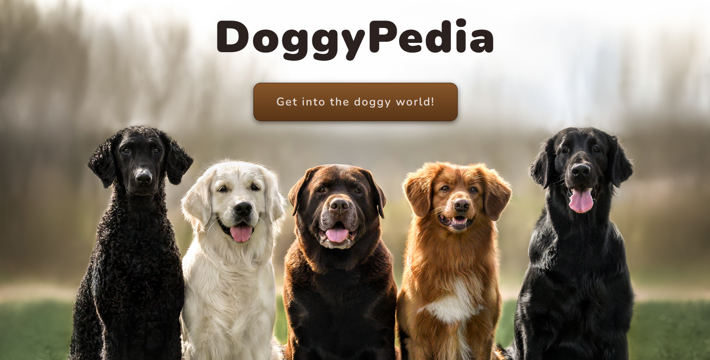

<h1 align="center" id="title">DoggyPedia</h1>

<p id="description">Explore an interactive and informative app dedicated to dog breeds 🐶.</p>

<h2>🖼️ Previews</h2>
<div>



</div>
  
  
<h2>🧐 Features</h2>

Here're some of the project's best features:

*   API RESTful that interacts with a third-party API and the database itself.
*   Fully responsive application for any screen size.
*   Search a breed by name.
*   Detail view of a breed.
*   Creation of a new breed.
*   Filters by temperament and origin.
*   Alphabetical and weight sorting.
*   Intuitive and truncated pagination.
*   Best UI/UIX Practices.
*   404 View.

<h2>🛠️ Installation Steps:</h2>

<p>1. Install server/api and client dependencies. [ both, api and client directories ]</p>

```shell
npm install
```

<p>2. Set your environment variables in an .env file.</p>
- GET AN API KEY HERE = https://thedogapi.com/

```.env
DB_USER=??? 
DB_PASSWORD=??? 
DB_HOST=??? 
DB_NAME=??? 
API_KEY=HEREYOURAPIKEY
```

<p>3. If you are NOT using PostgreSQL install the necessary dependencies and change the Sequelize connection in => api/src/db.js</p>
<a href="https://sequelize.org/docs/v6/getting-started/#connecting-to-a-database" target="_blank">More info on how to do this</a>

```js
const {   DB_USER DB_PASSWORD DB_HOST DB_NAME } = process.env;  

// ? PostgreSQL connection: Use your environment variables.
const sequelize = new Sequelize(`postgres://${DB_USER}:${DB_PASSWORD}@${DB_HOST}/${DB_NAME}`, {
  logging: false, // ? set to console.log to see the raw SQL queries
  native: false, // ? lets Sequelize know we can use pg-native for ~30% more speed
});
```

<p>4. Run the application!. [Both, first the api and then the client]</p>

```shell
npm start
```
